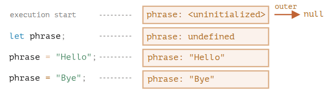
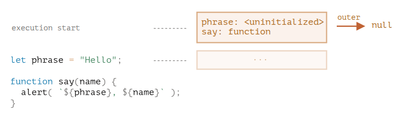
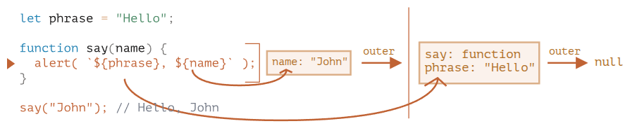

# Lexical Environment

**Lexical Environment** is a hidden/internal specification _OBJECT_ that JavaScript uses under the hood to manage and implement scope (deciding _where_ variables live and _who_ can access them).

> [!NOTE]
> _internal_ mean exists only theoretically so you can't access it in your code

Every time script run, function is called or block `{}` is executed, It creates a new **Lexical Environment** consisting of two parts:

1. **Environment Record**: An _object_ that stores all _local variables_, _parameters_ and value of `this` as its properties.
2. **Outer Reference** `[[Environment]]`: A _pointer_ to the outer (parent) Lexical Environment, which creates **scope chain**. For the **Global Lexical Environment** has no outer reference so it point to `null`

> [!NOTE]
> In JavaScript, a **Variable** is just a property of the _Environment Record_ internal object, Change a variable means change a property of that object.

## Variables and Function Declarations

When a Lexical Environment is created (Memory Allocation Phase), JavaScript scans the code first and register all variables and functions but initialized them differently:

> [!NOTE]
> In the picture execution start = memory allocation phase

### Variables (`let`/`const`)

**VARIABLES** was _Uninitialized_ at _memory allocation phase_ so engine know it exist, but they can't be used yet until it declaration line. ([Temporal Dead Zone](./temporal-dead-zone.md)) — This also apply to _function expression_ since it assign to variables.

When execution reaches the declaration line, The variables was _Initialized_ with the value provide. (`undefined` by default)

On the picture above demonstrate how _global_ Lexical Environment change during the execution

- the Rectangle means _Environment Record_ (variable store) for each line
- the Arrow means the _Outer Reference_, since it global Lexical Environment so it point to null

### Function Declaration

**FUNCTION DECLARATION** was instantly _Initialized_ at _memory allocation phase_, That why you can call a function declaration before it is defined in the code. (_Hosting_)

## Inner and Outer Lexical Environment (The Scope Chain)

When function runs, It automatically gets its own _lexical environment_, Which has _reference_ point to outer lexical environment

### When the code wants to access a variable, It follows a scope chain:

1. It searches the inner _lexical environment_ first (Its own scope)
2. If not found, then it follow the **outer reference** to outer/parent environment.
3. It repeats this until it hits the **global** lexical environment, If still not found it throw an error.

## Return Function
