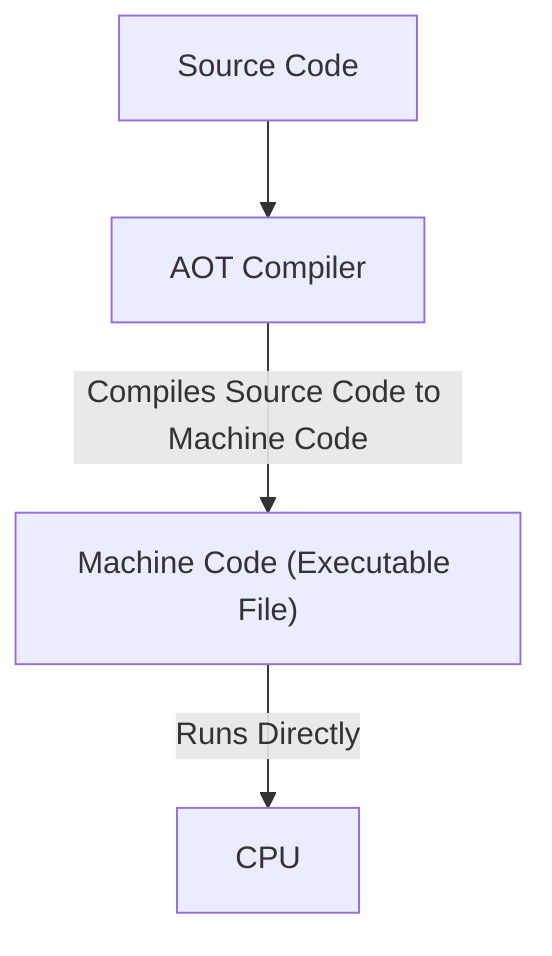
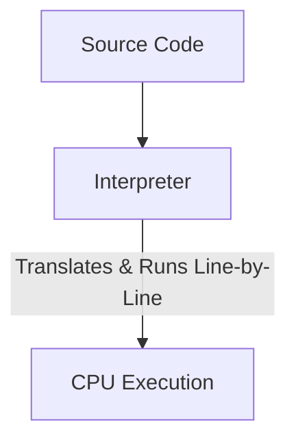
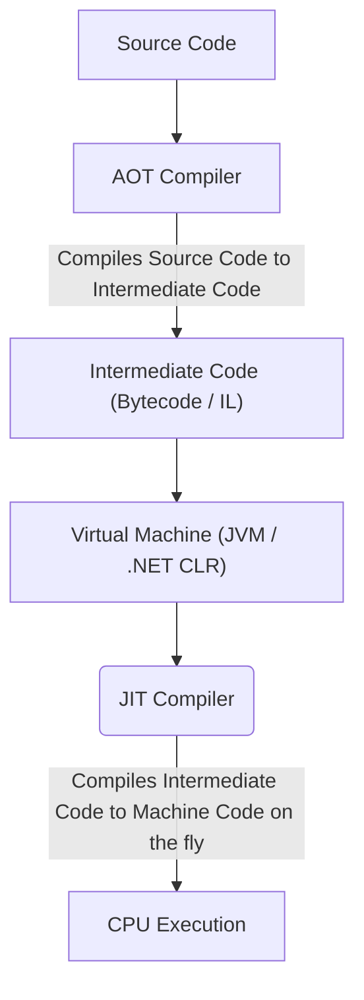

# How Programs Run

There are **3 main ways** program gets translated and executed by a computer:

- **Compiled Programs** (Ahead-of-Time / AOT)
- **Pure Interpreted Programs** (Line-by-Line)
- **Hybrid Programs** (Just-In-Time / JIT)

## Compiled Programs (Ahead-of-Time / AOT)



**Compiled Program** is a program that has been converted from human-readable source code into [machine code](./machine-code.md) (binary) _before_ it runs, allowing the CPU to **execute it directly** without needing any runtime as middleman.

- **Result**: A standalone binary executable file.
- **Behavior**: Run directly on hardware (CPU); fast and self-contained.
- **Example**: `Go`, `C`, `Rust`.

You can run executable file directly in your terminal by specifying its path:

```bash
./executable_file
```

## Pure Interpreted Programs (Line-by-Line)



**Interpreted Program** is a program that executed directly from source code by another program called an **Interpreter**. It reads, translates, and executes the script line-by-line on the fly at runtime.

- **Result**: No standalone executable file is created on your disk.
- **Behavior**: Slower execution speed.
- **Requirement**: Interpreter tool must be installed on the machine that running the code.
- **Example**: `Shell script`, `Basic Python scripts`

You must use interpreter program and pass the script file as argument to run it:

```bash
python3 main.py
```

## Hybrid Program (Just-In-Time / JIT)



**Hybrid Program** splits the compilation work into 2 steps.

1. **AOT Compiler:** Translates source code into a medium language (**Bytecode** or **Intermediate Language**) before run.
2. **Virtual Machine (VM)** uses an internal **JIT (Just-In-Time) Compiler** to compile chunks of that _intermediate code_ into [raw machine code](/cs-fundamentals/machine-code.md) right as the CPU need it during runtime.

- **Result**: An intermediate file (e.g. `.dll` in C#, `.class` in Java, or handled in-memory for JS)
- **Behavior**: Fast execution close to native performance, but depends heavily on an active _virtual machine runtime_.
- **Requirement**: **Runtime/VM must be installed** on the target machine to host and execute program (e.g. .NET Runtime for C#, or the JRE for Java)
- **Example**: `C# (.NET)`, `Java (JVM)`, `JavaScript (V8/Node.js)`

To execute the intermediate files or project bundles use the platform's runtime CLI:

```bash
dotnet run
java Main
node app.js
```
