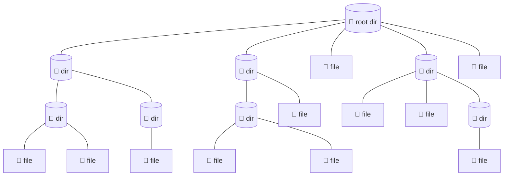

# Filesystem

**Filesystem** is the system that stores and organizes all the data on a computer into files and directories, structuring them like an upside-down tree (because the root sits at the top and the branches grow downward).

The **filesystem** tree start with a single directory at the very top called the _[root directory](./root-directory.md)_. This directory contains files and directories, which can contain more files and directories and so on indefinitely.

