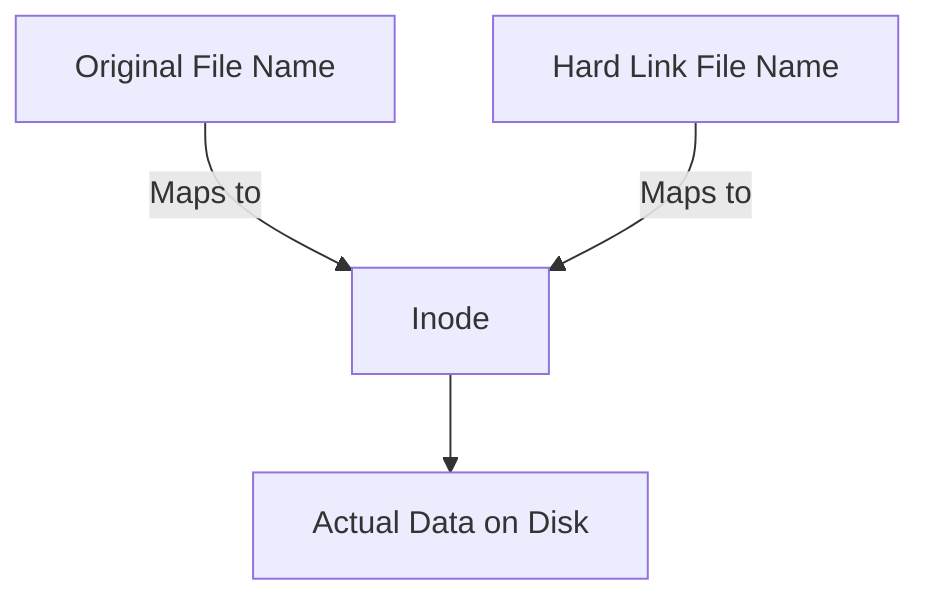

# Hard Link

**Hard Link** is just another filename that points directly to the exact same [_Inode_](./inode.md) as the original filename. — When create a hard link, it means creating another filename (text label) that links to the same Inode row of target file.

> [!NOTE]
> Hard Links are rarely used. 99% of the time we will use [**Symbolic Link**](./symbolic-link.md) instead.



## Create a Hard Link

To create a _hard link_, use [`ln` command](./ln-command.md).

**Syntax**: _the path to existing target file come first_, followed by the path and name where the hard link will be created.

```bash
ln <target-file-path> <hard-link-path>
```

**Example**:

```bash
ln original-file.md backup-link.md

# original-file.md is original file
# backup-link.md is hard link

ls -li
# Output
# 11927572 .rw-rw-r-- 2 amornthep amornthep  226 B  original-file.md
# 11927572 .rw-rw-r-- 2 amornthep amornthep  226 B  backup-link.md
#    ▲                ▲
# Shared Inode    Link Count is 2

```

## Behavior & Constraints

- **Shared Data**: Because both names points to the same Inode row, changing the data in one file instantly affects the other.
- **Safe Deletion**: The actual data is only deleted when **Link Count is 0** (meaning _all filename and hard link pointing to Inode are deleted_), So it mean deleting the original filename does not delete the actual data as long as there are other filename still pointing to that Inode.
- **Limitation**: **Can't** create hard links for _directories_.

---

## Related

- [Inode](./inode.md)
- [Symbolic Link](./symbolic-link.md)
- [`ln` command](./ln-command.md)
