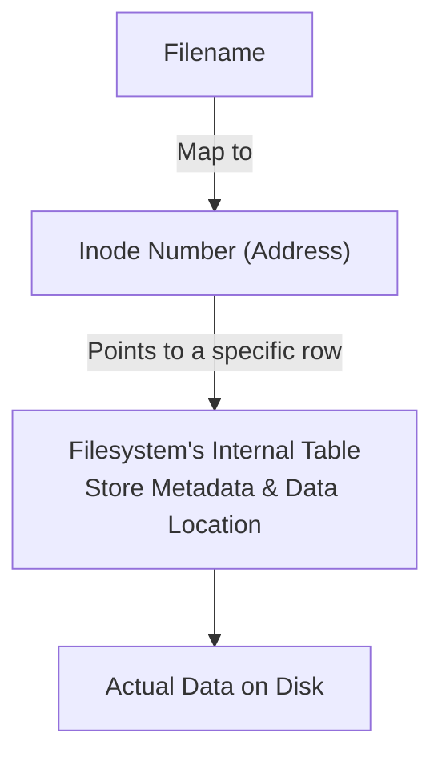

# Inode

**Inode (_Index Node_)** is a unique address number that points to a specific _row_ in the filesystem's table. This row stores file's metadata and data location.

> [!IMPORTANT]
> In Linux, **_filenames_ do not contain data**, A filename is just text label that maps directly to an Inode number.



```bash
# Display the Inode number (-i) along with file details
ls -li


# Output
# 11927572 .rw-rw-r-- amornthep amornthep  226 B  Sun Jul 12 19:14:22 2026 whoami-command.md
#    ▴
# Inode Number
```

## Core Metadata Stored in an Inode

- **File Size**
- **Permission (`rwxrwxrwx`)**
- **Owner and Group Identifiers**
- **Timestamps** (created, modified, and accessed times)
- **Physical disk block location** (Where raw data blocks live on hardware)
- **Link Count**: Total number of filenames pointing to this specific Inode

---

## Related

- [Hard Link](./hard-link.md)
- [Symbolic Link](./symbolic-link.md)
