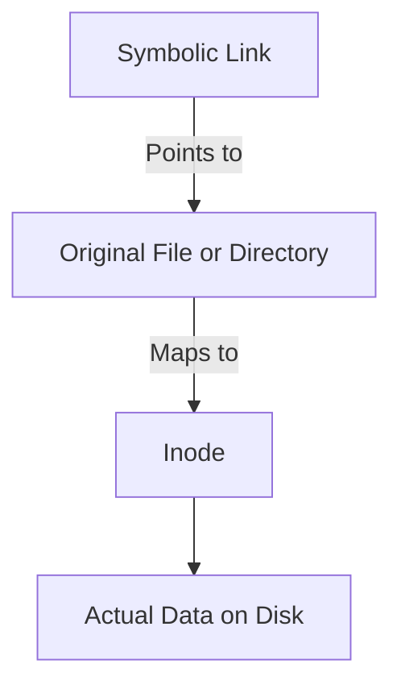

# Symbolic Link (symlink)

**Symbolic Link (_symlink_)** is a special type of file that **_points_ to another file or directory**. When we interact with a _symlink_, the _operating system_ automatically **follow the link to use the target file or directory instead**.

> [!NOTE]
> Also known as a **Soft Link** (acts like a Window shortcut).



## Create a Symbolic Link

To create a _symbolic link_, use the [`ln` command](./ln-command.md) with `-s` flag:

**Syntax**: _the path to existing target file or directory come first_, followed by the path and name where the symlink will be created.

```bash
ln -s <target-file/dir-path> <symlink-path>
```

**Example**: **Dotfiles Workflow**

We move a real configuration file (`~/.bashrc`) into a central directory that collect all personal config files together to manage it with Git, then creates a symlink in original location to point back so the system can still find it.

```bash
# 1. Move the actual target file to the dotfiles directory
mv ~/.bashrc ~/dotfiles/.bashrc

# 2. Create the symlink in the original location pointing to the moved file.
ln -s ~/dotfiles/.bashrc ~/.bashrc
```

Now, the system can access the configuration data smoothly via either path:

- `~/dotfile/.bashrc` is a file so accesses the actual data file directly.
- `~/.bashrc` is a symlink which instantly redirects the system to the target file.

> [!NOTE]
> From a high level, it looks like 2 files syncing their data in real time, but actually they is _one actual file_ and _one symlink_ redirecting the flow to that actual file.

## Behaviour & Constraints

- **Shared Data**: Changing the data via the _symlink_ instantly changes the actual file directly, because both indirectly points to the same data eventually.
- **Deletion**:
  - Deleting the **symlink** doesn't affect the target file at all, but anything relying on that _symlink_ path will break.
  - Deleting the **target file** breaks the setup. The actual data is lost, and the _symlink_ becomes **broken link** pointing to a non-existent path.
- **Flexibility**: Can create symlink pointing to directory. Unlike hard link.

## Useful Diagnostic Command

If you need to trace where an existing link points to or scan backward to find out what is linking to the directory, use these utilities:

### Trace a Link Forward

Find where an existing _symlink_ points.

1. Use `ls -l` (or `ls -al`) command to show file details, if it is a link, it shows a visual arrow (`->`) pointing to the destination.

```bash
# ls -al <symlink-path>

ls -al ~/.bashrc
# lrwxrwxrwx amornthep amornthep 32 B Tue Feb 24 12:14:43 2026 /home/amornthep/.bashrc ⇒ /home/amornthep/dotfiles/.bashrc
```

- The `l` at the beginning of `lrwxrwxrwx` means it is a link.
- The arrow `⇒` shows the real directory or file that symlink is linking to.

> [!TIP]
> You can use `ls -al <path-to-directroy>` to list the contents in directory, and just look for lines start with `l` to spot the symlink inside it.

2. Use `readlink` command to show output _only_ the cleaned, raw path string.

```bash
# readlink <symlink-path>

readlink ~/.bashrc
# /home/amornthep/dotfiles/.bashrc
```

### Search for Links Backward (Reverse Lookup)

Search a target directory for _symlinks_ linking back to a specific name pattern using `find` command with the `-lname` options to

```
find <target-directory-to-search> -lname "<search-pattern>" 2>/dev/null
```

```bash
find ~ -lname "*dotfiles/config*" 2>/dev/null
```

Scan the _home_ directory to find _symlinks_ pointing to paths containing `dotfiles/config` inside.

---

## Related

- [`ln` command](./ln-command.md)
- [file](./file.md)
- [directory](./directory.md)
- [Hard Link](./hard-link.md)
- [`find` command](./find-command.md)
